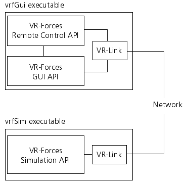

注意：
- 使用VR-Forces API必须安装VR-Link。重建GUI或者创建有GUI的API示例时，必须安装QT
- 本手册假定你已安装VR-Forces的SDK

VR-Force的API包括
- 仿真API（Simulation API）
- 远程控制API（Remote Control API）
- 地形API（Terrain API）
- 图形用户界面API（GUI API）

VR-Forces包含两种可执行程序
- vrfGui即图形用户界面
- vrfSim是负责响应GUI的用户动作，并向外发送vrfGUI显示数据的仿真引擎

下图展示了在VR-Forces应用程序中 各种API如何被应用

# 介绍VR-Forces工具集
## VR-Forces 仿真API
简称为VR-Forces API，提供了多种运行CGF仿真引擎所需的类和函数。API为用户执行仿真程序所需要的的元素提供代码库，包括：
- 车辆动力（Vehicle dynamics）
- 控制对象（Control Object）
- 传感器（Sensors）
- 控制器（Contollers）
- 武器系统（Weapons System）
- 无线系统（Radios）
- 地形描述（Terrain representation）
- 坐标转换（Coordinate conversions）
- 网络信息（Network messages）
- 任务管理（Tasks）
- 计划（Plans）

此外，它还提供了一个将所有这些功能连接在一起的仿真引擎框架。vrfSim应用程序主要使用VR-Forces API。

## VR-Forces 图形用户接口API

图形用户接口API提供了实现VR-Forces GUI 的代码库。用户可以用这些API去自定义或者扩展vrfGUI应用程序，或者将功能嵌入到其他的应用程序中。

VR-Forces前端是用VR-Vantage SDK构建的。

## VR-Forces地形API（VR-inTerra）
VR-inTerra可以为对地形数据库实现读、写和查询操作提供类库和代码。可以：
- 载入MAK GDB（MAK自定义）格式及其扩展格式（OpenFlight、ESRI Shapefile和CTDB）的地形数据库
- 以MAK GDB格式保存地形数据库
- 访问和操作地形的几何（多边形）数据和矢量数据
- 用地形几何数据和矢量网络进行交叉检测
- 查询矢量网络中的特征数据信息

VR-Forces GUI使用API访问几何和矢量数据显示地形数据。仿真引擎使用地形API为地面机动模型和传感器模型的通视进行地形交叉检测

## VR-Forces远程控制API
远程控制API允许应用程序控制一个或多个远程的应用程序。vrfGui用远程控制API控制vrfSim或其他应用程序

## VR-Forces API共享类和库
某些类和库在两个或多个VR-Forces API中共享。如GUI API和仿真API都是用同一组类来表示地形，仿真API和远程控制API都用同样的类来描述任务和计划

## VR-Forces和VR-Link
VR-Forces API依靠VR-Link来处理DIS和HLA网络。如，远程控制API是用VR-Link给VR-Forces发送控制信息。仿真API是用VR-Link向外发送关于仿真对象的信息，并查找仿真世界中需要与之交互的其他对象。GUI API是用VR-Link查找演练中的所有对象，从而能够在地图上绘制所有对象。

VR-Link为DIS和HLA提供了协议无关的接口。当你是用这些接口时，你不必知道更底层的协议细节就可以构建应用程序。同时VR-Forces应用程序可以利用VR-Link工具管理对象和交互，如反射实体列表。

# 扩展VR-Forces： 插件形式或独立应用程序
如果想修改或扩展VR-Forces，有两种主要的途径：一种是插件式，一种是独立重构式（重建vrfSim或vrfGui）

当有如下需求时，可采用插件式：
- 需要在不变更已安装的VR-Forces的基础上进行修改或升级。这样可以允许你在不重装整个应用程序的基础上实施你的修改
- 需要将你的扩展与其他开发人员集成的时候
- 可以在一个特定的仿真中按需添加或去除一个新特性。在理想情况下，一个插件应该只包含一个特定的功能。

当有如下需求时，可重构应用程序：
- 需要去除系统中的某个功能时
- 修改需要重载的类
- 采用工厂的方式来增加子类或安装新的对象以实现扩展，而不是默认的方式

独立和插件在代码上的差异是用户是修改的main.cxx还是plugin.cxx。用户实现新功能的代码都是相同的

注意：如果需要载入继承同一个对象的多个插件时（如DtVrfGuiWindow），则最后一个载入的插件才生效。因此要创建一个继承对象的插件时，应当确认所派生子类和扩展不与其他插件冲突